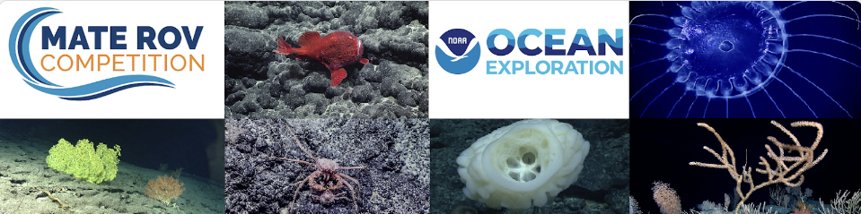

# Brittle Star Detection with YOLOv8



## Project Overview

This project was developed by __Politocean MATE Teams__ in response to the __2024 MATE ROV Competition__ in partnership with NOAA Ocean Exploration.

### MATE ROV Competition

The competition presented a challenge focused on automating the process of annotating organisms in ROV dive videos, a task traditionally requiring extensive human involvement. The aim of this project is to streamline this process by leveraging Artificial Intelligence (AI) to detect and track a specific organism `brittle stars` throughout continuous video footage captured from an ROV submersible.

### Brittle Star Detection

This project focuses on training and testing a `YOLOv8` model for detecting `brittle stars` in underwater footage. The project includes custom dataset preparation, model training, and evaluation on the brittle star class using the YOLOv8 model.

## Tracking Demo

[Watch the video on YouTube](https://youtu.be/zeGXB6fh-jM)

Click the link above to watch the tracking demo.

## Project Structure

- `tracker.py`:  The Script is designed for object tracking in video files using a trained YOLOv8 model. It allows users to perform real-time object detection and tracking, with options for saving the output by exporting it and displaying results.
- `annotator.py`: Script that handles the annotation process by automating parts of the labeling, leveraging both manual annotations and AI-assisted predictions.

## Installation

Before running the code, ensure you have the required dependencies installed. You can install them using:

```bash
pip install ultralytics
```

This will install the `ultralytics` package, which includes the YOLOv8 model and other required dependencies.

> For more information of this package, please refer to the [official documentation](https://docs.ultralytics.com/modes/train/)

### Data Preparation

The dataset was created and annotated by extracting frames from a given video (where you can find it under this like [Reference Footage](https://drive.google.com/file/d/1Wb9GjKUs6-hu4zLdTqaahYo66ZOhCXhr/view) ), with annotations done both manually and with AI assistance. Initially, a small set of samples was manually annotated. This annotated data was used to train a model, which then made further annotations. These AI-generated annotations were corrected by humans, and the process was repeated multiple times to create a well-annotated dataset.

The script `annotator.py` was used to automate parts of this process, enabling efficient annotation and training cycles.

## Training

To train the YOLOv8 model on the custom dataset, use the following command:

```shell
yolo task=detect mode=train model='yolov8m.yaml', pretrained='/models//best.pt' data='/content/MAC-4/data.yaml' epochs=100 imgsz=640 batch=16 name='FP_v7' 
```

## Inference

An Example of video inferencing by `tracker.py`, use the following command:

```shell
python tracker.py --video input_video.mp4 --model yolov8m.pt --export --output output_video.mp4
```

To get information about the available options, you can pass the `--help` flag

> This script also involves model exporting to a more efficient format, such as `onnx` or `engine` corresponding to a given device type (`cpu`, `gpu`) by passing `--export_model` flag. and it will automatically save the model under the model path with the same name and perform the inference based on the exported model. An Example of exporting the model to `onnx` format:

```shell
python tracker.py --video input_video.mp4 --model yolov8m.pt --export_model --device cpu
```

## Acknowledgements

This project utilizes the YOLOv8 model by Ultralytics for object detection tasks. The custom dataset and annotations were specifically prepared for the brittle star detection task, with the help of manual and AI-assisted annotation processes.
